# Relatório de Identificação de Sistemas

## Motivação

A identificação de sistemas é uma área fundamental da engenharia de controle que permite obter modelos matemáticos de processos a partir de dados de entrada e saída. Conhecendo o modelo de um sistema, é possível projetar controladores eficazes, realizar simulações e antecipar o comportamento do processo em diferentes condições operacionais.

Este projeto implementa, em Rust, seis métodos clássicos de identificação de sistemas a partir da resposta ao degrau: **Ziegler-Nichols**, **Hägglund**, **Smith (1ª ordem)**, **Sundaresan-Krishnaswamy**, **Mollenkamp** e **Smith (2ª ordem)**. Os quatro primeiros identificam sistemas de primeira ordem com atraso (FOPDT), enquanto os dois últimos identificam sistemas de segunda ordem com atraso (SOPDT). A qualidade de cada identificação é avaliada pelas métricas IAE, ISE e ITAE, que quantificam o erro integrado entre o sinal real e o modelo identificado.

Os conjuntos de dados incluem tanto sinais coletados experimentalmente (`conjunto1` a `conjunto6`) quanto sinais gerados por sistemas conhecidos (`system3` a `system15`), permitindo validar os métodos em cenários com diferentes características dinâmicas.

---

## Como executar o código

**Pré-requisitos:** Rust (edição 2024) e Cargo instalados.

### Identificação dos sistemas

```sh
cargo run --release -- identification &> output/output.txt
```

### Geração dos sinais sintéticos

```sh
cargo run --release -- generate-samples
```

### Visualização dos sistemas de referência

```sh
cargo run --release -- systems
```

---

## Metodologia

### Pré-processamento

Antes de aplicar os métodos de identificação, cada sinal de resposta ao degrau é filtrado por um **filtro passa-baixas de primeira ordem** com frequência de corte específica por dataset (0,5 Hz a 100 Hz). Isso remove ruídos de alta frequência que prejudicariam a estimativa dos pontos característicos da curva de resposta.

### Métodos de Identificação de 1ª Ordem (FOPDT)

Os métodos a seguir estimam três parâmetros: ganho estático **K**, tempo morto **θ** e constante de tempo **τ**, resultando na função de transferência:

$$G(s) = \frac{K}{\tau s + 1} e^{-\theta s}$$

| Método | Descrição |
|--------|-----------|
| **Ziegler-Nichols** | Utiliza a tangente no ponto de inflexão da curva de resposta ao degrau para determinar θ e τ. |
| **Hägglund** | Variação do método de Ziegler-Nichols com estimativa aprimorada de τ usando dois pontos na tangente. |
| **Smith (1ª ordem)** | Identifica τ e θ pelos tempos em que a saída atinge 28,3% e 63,2% do valor final. |
| **Sundaresan-Krishnaswamy** | Utiliza os instantes em que a saída atinge 35,3% e 85,3% do valor final, oferecendo maior robustez a ruídos. |

### Métodos de Identificação de 2ª Ordem (SOPDT)

Os métodos a seguir estimam: ganho **K**, tempo morto **θ**, coeficiente de amortecimento **ζ** e frequência natural **ωₙ**:

$$G(s) = \frac{K \omega_n^2}{s^2 + 2\zeta\omega_n s + \omega_n^2} e^{-\theta s}$$

| Método | Descrição |
|--------|-----------|
| **Mollenkamp** | Estima os parâmetros a partir de cinco pontos característicos da resposta ao degrau (tempos em 10%, 30%, 50%, 70% e 90% do valor final). |
| **Smith (2ª ordem)** | Utiliza a razão entre os tempos em que a saída atinge determinadas frações do valor final para estimar ζ e ωₙ. Requer que o parâmetro de razão esteja entre 0,255 e 0,8. |

### Métricas de Qualidade

| Métrica | Fórmula | Característica |
|---------|---------|----------------|
| **IAE** | $\int_0^\infty \|e(t)\| \, dt$ | Penaliza erros persistentes igualmente |
| **ISE** | $\int_0^\infty e^2(t) \, dt$ | Penaliza erros grandes mais fortemente |
| **ITAE** | $\int_0^\infty t\|e(t)\| \, dt$ | Penaliza erros que persistem por longo tempo |

---

## Resultados

### conjunto1 (f_corte = 10 Hz)

| Método | K | θ | τ / ζ | ωₙ | IAE | ISE | ITAE |
|--------|---|---|-------|----|-----|-----|------|
| Ziegler-Nichols | 0,9957 | 0,0118 | τ=0,1307 | — | 0,0515 | 0,00504 | 11,826 |
| **Hägglund** | **0,9957** | **0,0118** | **τ=0,0827** | **—** | **0,0148** | **0,000460** | **4,133** |
| Smith1 | 0,9957 | 0,0160 | τ=0,0990 | — | 0,0222 | 0,00140 | 4,621 |
| Sundaresan | 0,9957 | 0,0161 | τ=0,1005 | — | 0,0238 | 0,00155 | 4,927 |
| Mollenkamp | 0,9962 | 0,0070 | ζ=2,441 | 46,73 | 0,0181 | 0,000818 | 4,217 |
| Smith2 | 0,9962 | 0,0090 | ζ=0,170 | 32,04 | 0,1376 | 0,06741 | 27,122 |

> **Melhor método:** Hägglund (menor IAE, ISE e ITAE).

| Hägglund | Smith1 |
|----------|--------|
| 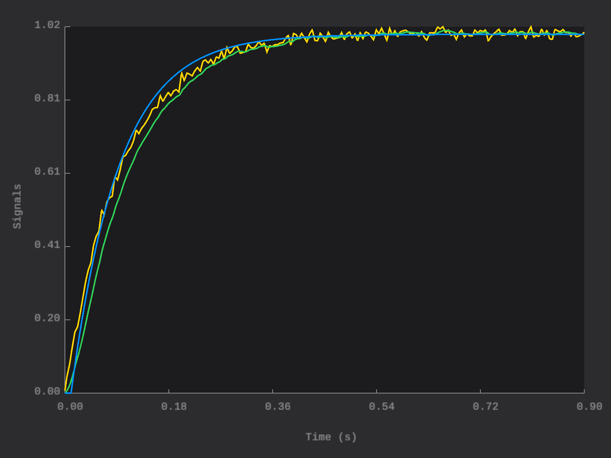 | 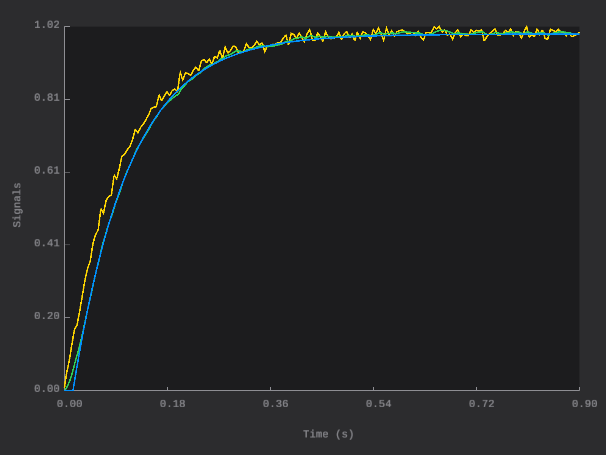 |

---

### conjunto2 (f_corte = 2,5 Hz)

> **Nota:** K negativo indica sistema com fase não-mínima ou inversão de sinal na resposta.

| Método | K | θ | τ / ζ | ωₙ | IAE | ISE | ITAE |
|--------|---|---|-------|----|-----|-----|------|
| Ziegler-Nichols | −2,036 | 3,130 | τ=0,529 | — | 0,0846 | 0,01305 | 466,83 |
| Hägglund | −2,036 | 3,130 | τ=0,334 | — | 0,0818 | 0,01112 | 463,85 |
| **Smith1** | **−2,036** | **3,076** | **τ=0,500** | **—** | **0,0751** | **0,00887** | **434,94** |
| Sundaresan | −2,036 | 3,120 | τ=0,511 | — | 0,0817 | 0,01166 | 457,09 |
| Mollenkamp | −2,034 | 2,955 | ζ=1,188 | 4,079 | 0,0730 | 0,00808 | 428,48 |
| Smith2 | — | — | — | — | FALHOU | — | — |

> **Melhor método:** Smith1 (menor IAE e ISE). Smith2 falhou pois o parâmetro de razão (0,824) excedeu o limite máximo de 0,8.

| Hägglund | Smith1 |
|----------|--------|
| 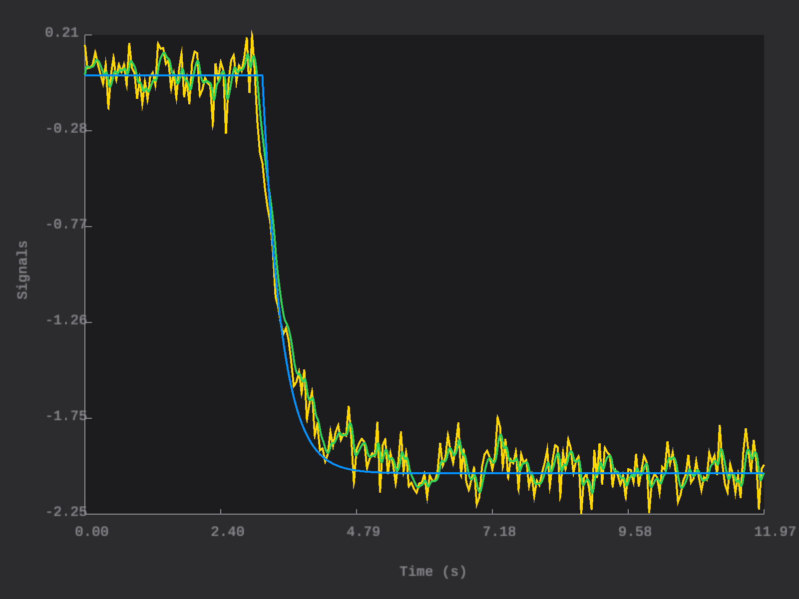 | 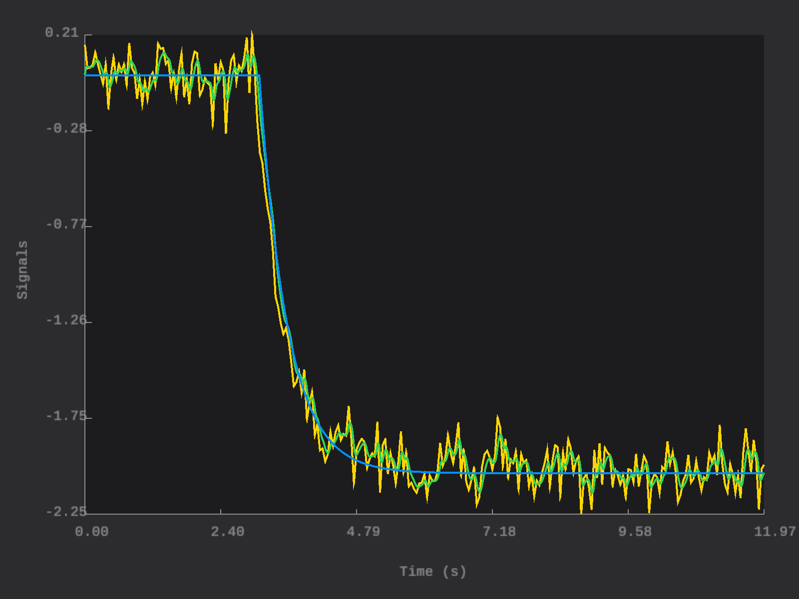 |

---

### conjunto3 (f_corte = 2,5 Hz)

| Método | K | θ | τ / ζ | ωₙ | IAE | ISE | ITAE |
|--------|---|---|-------|----|-----|-----|------|
| Ziegler-Nichols | 1,0042 | 0,4297 | τ=0,9249 | — | 0,1012 | 0,02197 | 186,47 |
| Hägglund | 1,0042 | 0,4297 | τ=0,5846 | — | 0,0558 | 0,00646 | 110,68 |
| Smith1 | 1,0042 | 0,3655 | τ=0,6435 | — | 0,0547 | 0,00648 | 113,59 |
| Sundaresan | 1,0042 | 0,4871 | τ=0,4288 | — | 0,0432 | 0,00437 | 88,70 |
| **Mollenkamp** | **1,0043** | **0,0709** | **ζ=0,520** | **1,659** | **0,0233** | **0,000981** | **49,86** |
| Smith2 | 1,0043 | 0,1670 | ζ=0,502 | 3,329 | 0,0744 | 0,01736 | 120,50 |

> **Melhor método:** Mollenkamp (menor IAE, ISE e ITAE).

| Mollenkamp | Sundaresan |
|------------|------------|
| 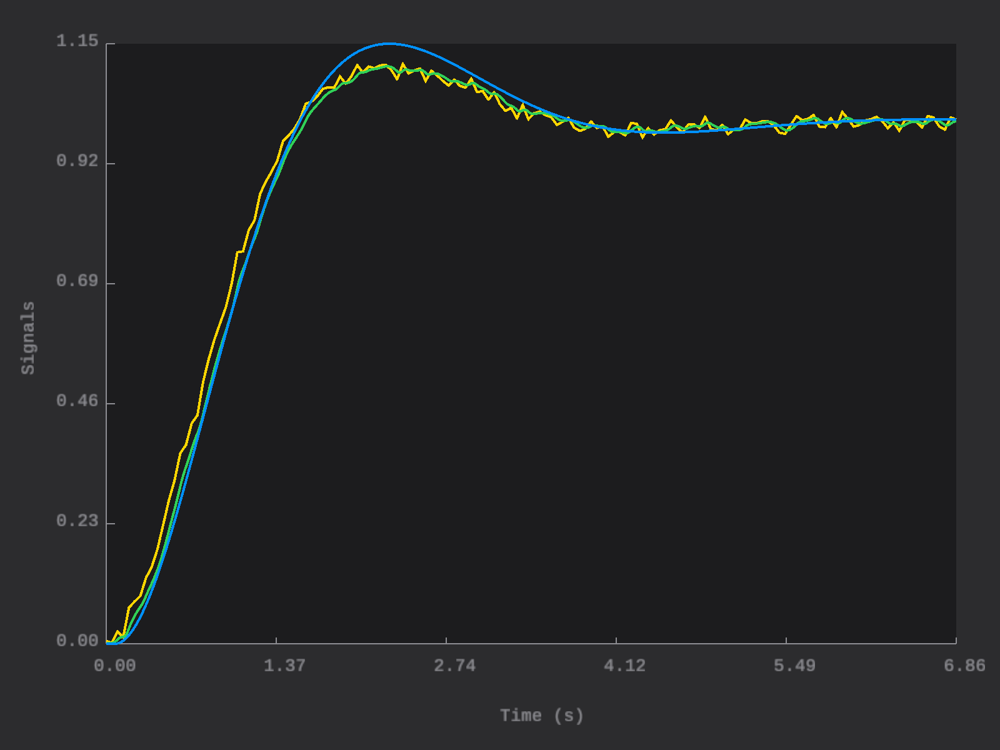 | 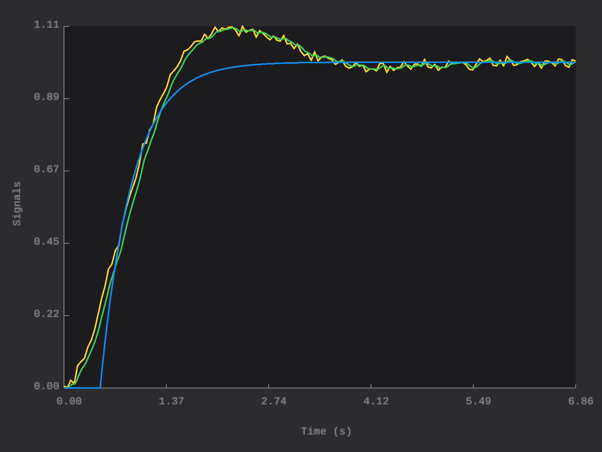 |

---

### conjunto4 (f_corte = 0,5 Hz)

| Método | K | θ | τ / ζ | ωₙ | IAE | ISE | ITAE |
|--------|---|---|-------|----|-----|-----|------|
| Ziegler-Nichols | 1,9835 | 2,392 | τ=1,033 | — | 0,1809 | 0,06098 | 670,62 |
| **Hägglund** | **1,9835** | **2,392** | **τ=0,653** | **—** | **0,0981** | **0,01853** | **355,42** |
| Smith1 | 1,9835 | 2,402 | τ=0,849 | — | 0,1429 | 0,03848 | 518,11 |
| Sundaresan | 1,9835 | 2,515 | τ=0,690 | — | 0,1354 | 0,04124 | 473,80 |
| Mollenkamp | 1,9835 | 2,144 | ζ=0,965 | 1,915 | 0,1240 | 0,03071 | 441,89 |
| Smith2 | 1,9835 | 2,211 | ζ=0,450 | 2,861 | 0,1503 | 0,05928 | 541,42 |

> **Melhor método:** Hägglund (menor IAE, ISE e ITAE).

| Hägglund | Mollenkamp |
|----------|------------|
| 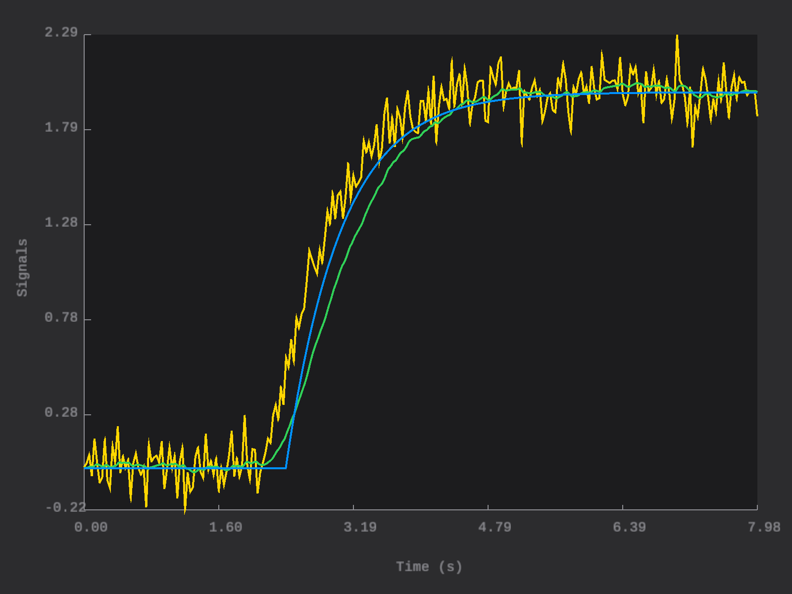 | 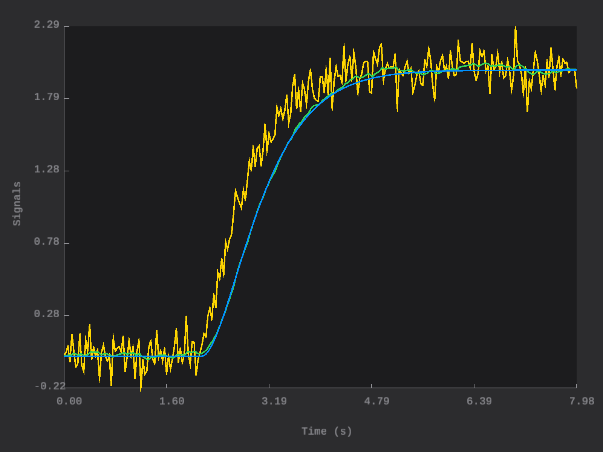 |

---

### conjunto5 (f_corte = 1,5 Hz)

| Método | K | θ | τ / ζ | ωₙ | IAE | ISE | ITAE |
|--------|---|---|-------|----|-----|-----|------|
| Ziegler-Nichols | 0,6636 | 1,846 | τ=0,825 | — | 0,0607 | 0,00826 | 188,93 |
| Hägglund | 0,6636 | 1,846 | τ=0,521 | — | 0,0380 | 0,00324 | 119,64 |
| Smith1 | 0,6636 | 1,906 | τ=0,519 | — | 0,0426 | 0,00384 | 130,34 |
| Sundaresan | 0,6636 | 2,004 | τ=0,369 | — | 0,0386 | 0,00335 | 116,03 |
| **Mollenkamp** | **0,6636** | **1,686** | **ζ=0,651** | **2,279** | **0,0292** | **0,001859** | **85,37** |
| Smith2 | 0,6636 | 1,815 | ζ=0,304 | 5,160 | 0,0571 | 0,01142 | 161,14 |

> **Melhor método:** Mollenkamp (menor IAE, ISE e ITAE).

| Mollenkamp | Hägglund |
|------------|----------|
| 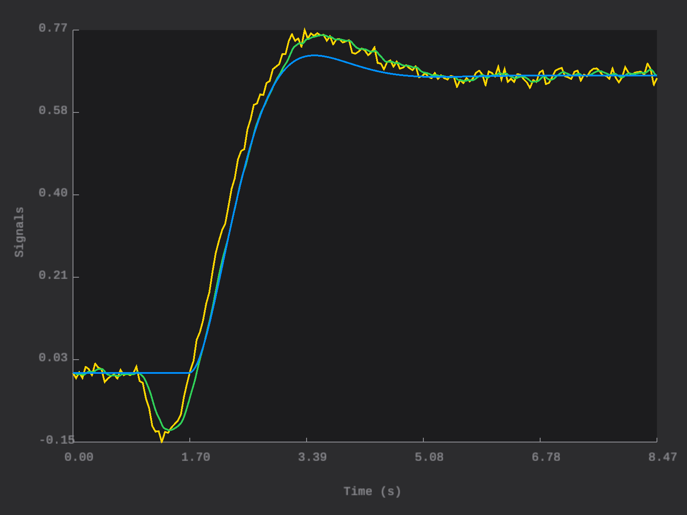 | 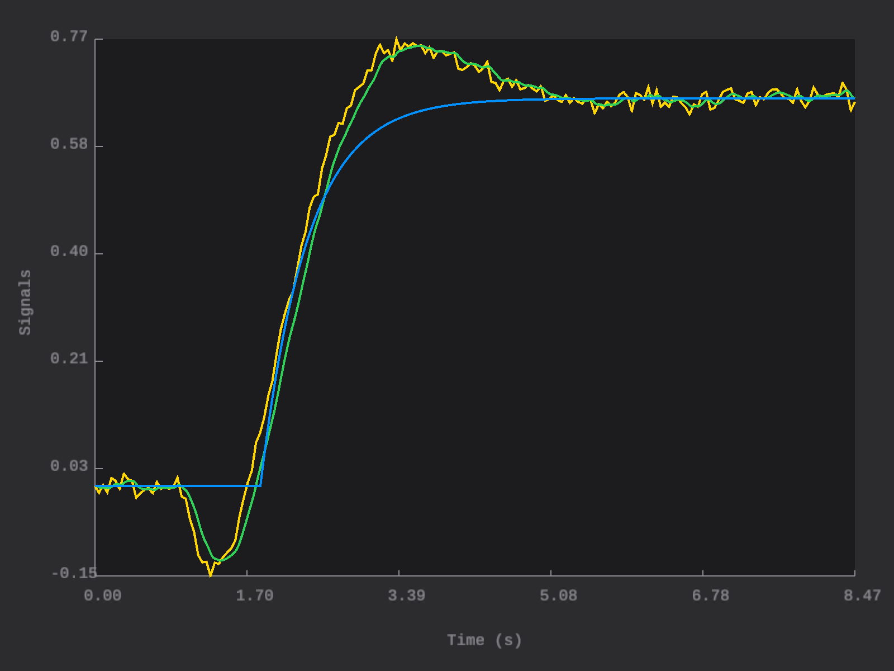 |

---

### conjunto6 (f_corte = 0,5 Hz)

| Método | K | θ | τ / ζ | ωₙ | IAE | ISE | ITAE |
|--------|---|---|-------|----|-----|-----|------|
| Ziegler-Nichols | 0,001993 | 4,391 | τ=0,534 | — | 1,27×10⁻⁴ | 6,65×10⁻⁸ | 0,832 |
| Hägglund | 0,001993 | 4,391 | τ=0,338 | — | 1,07×10⁻⁴ | 3,88×10⁻⁸ | 0,726 |
| Smith1 | 0,001993 | 4,425 | τ=0,342 | — | 1,11×10⁻⁴ | 4,58×10⁻⁸ | 0,747 |
| Sundaresan | 0,001993 | 4,528 | τ=0,235 | — | 1,12×10⁻⁴ | 5,19×10⁻⁸ | 0,750 |
| Mollenkamp | 0,001993 | 4,205 | ζ=0,422 | 2,578 | 1,21×10⁻⁴ | 4,66×10⁻⁸ | 0,812 |
| **Smith2** | **0,001993** | **4,232** | **ζ=0,669** | **4,670** | **8,36×10⁻⁵** | **1,50×10⁻⁸** | **0,615** |

> **Melhor método:** Smith2 (menor IAE, ISE e ITAE).

| Smith2 | Hägglund |
|--------|----------|
| 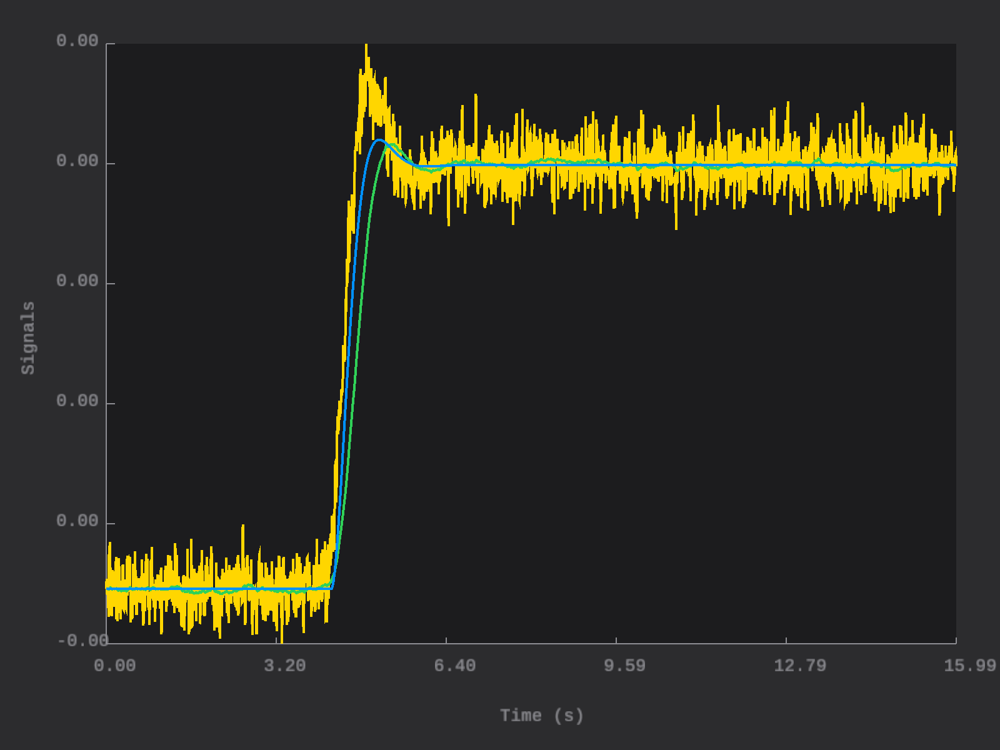 |  |

---

### system3 — $\frac{2(15s+1)}{(20s+1)(s+1)(0{,}1s+1)^2}$ (f_corte = 100 Hz)

> Sistema de 4ª ordem com zero. Sundaresan, Mollenkamp e Smith2 falharam por gerarem θ negativo ou parâmetro fora do intervalo válido.

| Método | K | θ | τ / ζ | ωₙ | IAE | ISE | ITAE |
|--------|---|---|-------|----|-----|-----|------|
| Ziegler-Nichols | 1,9735 | 0,146 | τ=1,811 | — | 0,1103 | 0,02135 | 1961,10 |
| Hägglund | 1,9735 | 0,146 | τ=1,144 | — | 0,1290 | 0,03002 | 2025,52 |
| **Smith1** | **1,9735** | **0,054** | **τ=1,857** | **—** | **0,1097** | **0,02120** | **1959,11** |
| Sundaresan | — | — | — | — | FALHOU | — | — |
| Mollenkamp | — | — | — | — | FALHOU | — | — |
| Smith2 | — | — | — | — | FALHOU | — | — |

> **Melhor método:** Smith1 (menor ITAE entre os que convergiram).

| Ziegler-Nichols | Smith1 |
|-----------------|--------|
| 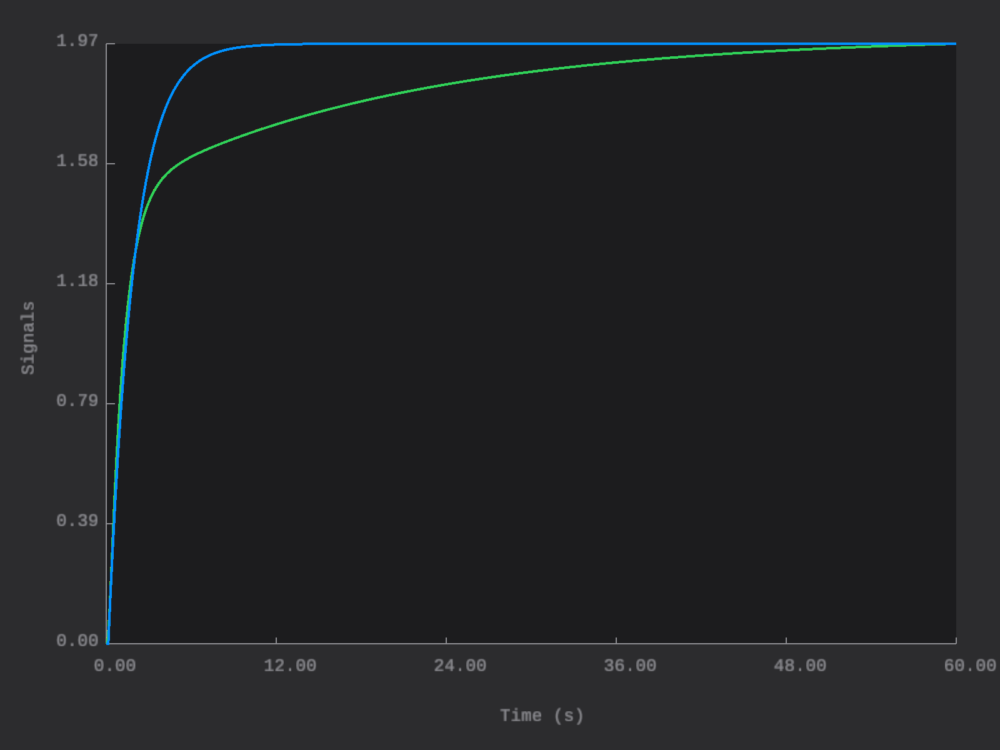 |  |

---

### system6 — $\frac{(0{,}17s+1)^2}{s(s+1)^2(0{,}028s+1)}$ (f_corte = 100 Hz)

> Sistema com integrador. Mollenkamp falhou por gerar θ negativo.

| Método | K | θ | τ / ζ | ωₙ | IAE | ISE | ITAE |
|--------|---|---|-------|----|-----|-----|------|
| Ziegler-Nichols | 8,310 | 1,686 | τ=8,313 | — | 1,009 | 1,7646 | 7372,72 |
| Hägglund | 8,310 | 1,686 | τ=5,254 | — | 0,467 | 0,3645 | 3057,35 |
| **Smith1** | **8,310** | **2,465** | **τ=4,470** | **—** | **0,421** | **0,3210** | **2543,49** |
| Sundaresan | 8,310 | 3,398 | τ=2,817 | — | 0,574 | 0,5180 | 2715,53 |
| Mollenkamp | — | — | — | — | FALHOU | — | — |
| Smith2 | 8,310 | 0,927 | ζ=0,484 | 0,471 | 2,218 | 7,0876 | 14006,68 |

> **Melhor método:** Smith1 (menor IAE, ISE e ITAE).

| Smith1 | Hägglund |
|--------|----------|
| 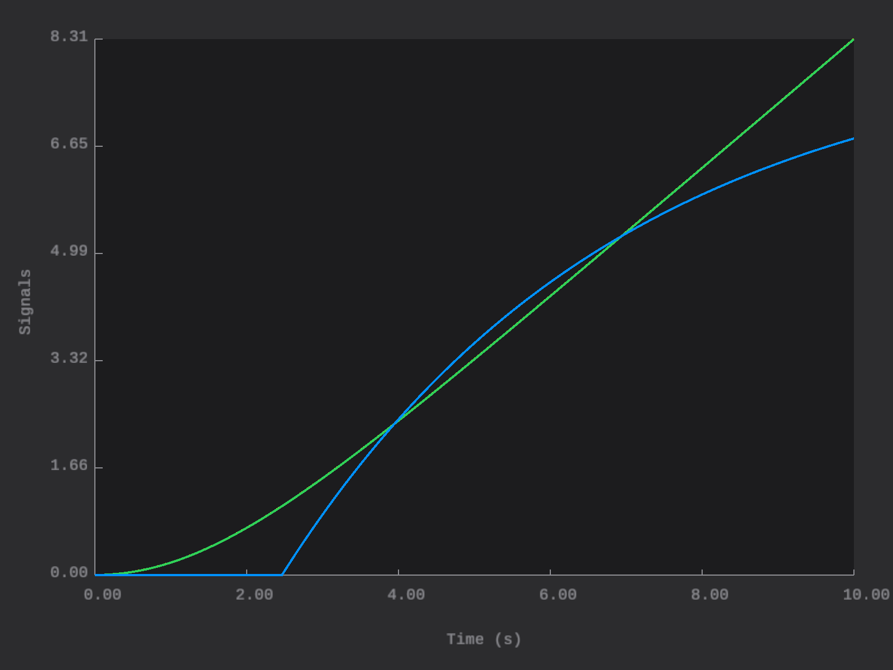 | 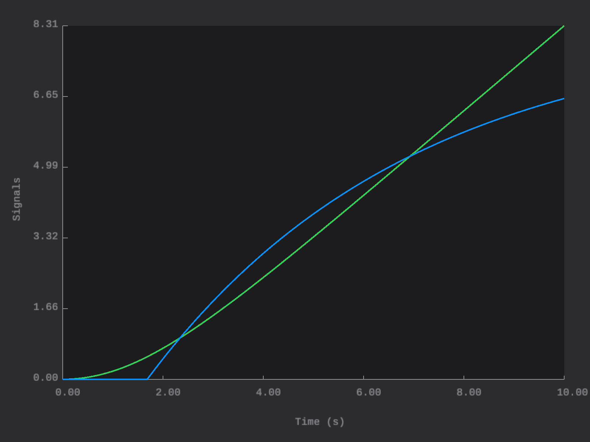 |

---

### system9 — $\frac{1}{(s+1)^2} e^{-s}$ (f_corte = 100 Hz)

> Sistema de 2ª ordem com atraso de 1 segundo.

| Método | K | θ | τ / ζ | ωₙ | IAE | ISE | ITAE |
|--------|---|---|-------|----|-----|-----|------|
| Ziegler-Nichols | 0,9988 | 1,283 | τ=2,715 | — | 0,08973 | 0,01125 | 484,91 |
| Hägglund | 0,9988 | 1,283 | τ=1,716 | — | 0,02151 | 0,000845 | 92,18 |
| Smith1 | 0,9988 | 1,505 | τ=1,640 | — | 0,01621 | 0,000451 | 79,27 |
| Sundaresan | 0,9988 | 1,643 | τ=1,439 | — | 0,01238 | 0,000625 | 42,03 |
| **Mollenkamp** | **0,9988** | **0,995** | **ζ=1,005** | **1,004** | **0,00130** | **2,13×10⁻⁶** | **7,19** |
| Smith2 | 0,9988 | 1,216 | ζ=0,321 | 1,646 | 0,1504 | 0,07486 | 513,01 |

> **Melhor método:** Mollenkamp, com desempenho excepcional (IAE ≈ 0,0013), pois o sistema real é de 2ª ordem e o modelo identificado captura bem essa dinâmica (ζ ≈ 1,0, ωₙ ≈ 1,0 correspondem a dois polos em s = −1).

| Mollenkamp | Sundaresan |
|------------|------------|
| 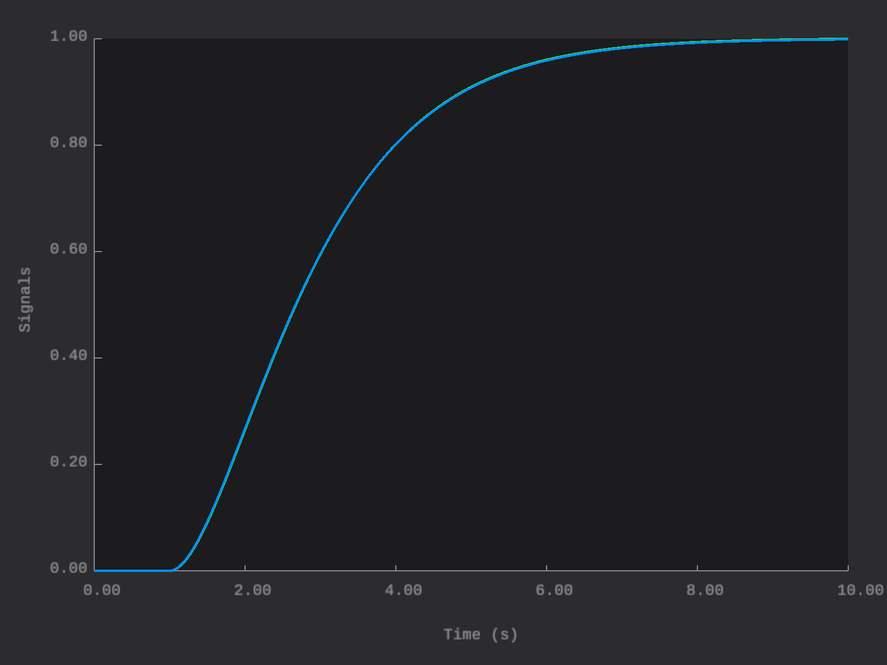 | 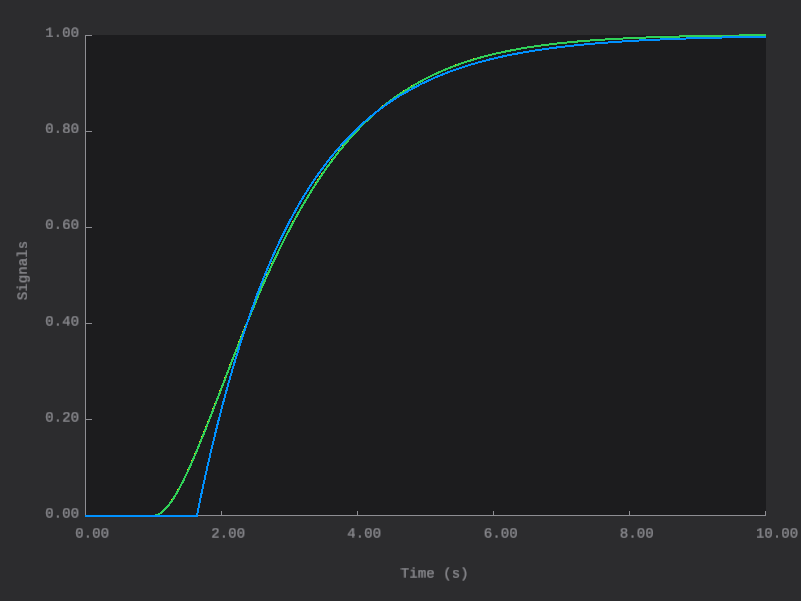 |

---

### system12 — $\frac{(6s+1)(3s+1)}{(10s+1)(8s+1)(s+1)} e^{-0{,}3s}$ (f_corte = 100 Hz)

> Sistema de 3ª ordem com zeros e atraso. Smith1, Sundaresan, Mollenkamp e Smith2 falharam por gerarem θ negativo ou parâmetro fora do intervalo válido.

| Método | K | θ | τ / ζ | ωₙ | IAE | ISE | ITAE |
|--------|---|---|-------|----|-----|-----|------|
| **Ziegler-Nichols** | **0,9964** | **0,301** | **τ=4,462** | **—** | **0,0884** | **0,01589** | **1380,80** |
| Hägglund | 0,9964 | 0,301 | τ=2,820 | — | 0,1157 | 0,02979 | 1587,62 |
| Smith1 | — | — | — | — | FALHOU | — | — |
| Sundaresan | — | — | — | — | FALHOU | — | — |
| Mollenkamp | — | — | — | — | FALHOU | — | — |
| Smith2 | — | — | — | — | FALHOU | — | — |

> **Melhor método:** Ziegler-Nichols (único que produziu métricas finitas além de Hägglund). A presença de zeros no sistema dificulta a identificação pelos demais métodos.

| Ziegler-Nichols | Hägglund |
|-----------------|----------|
| 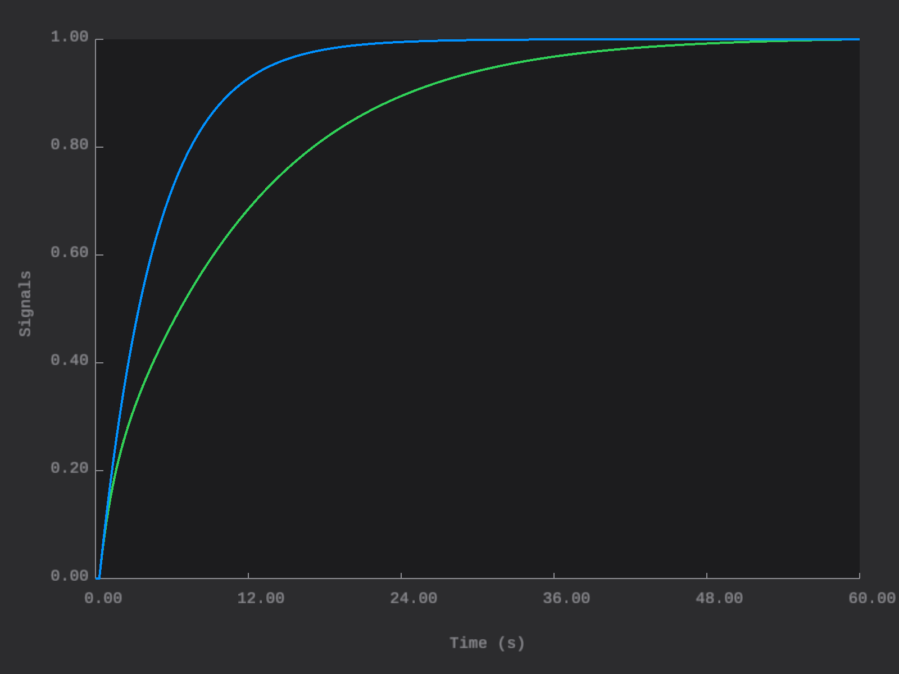 | 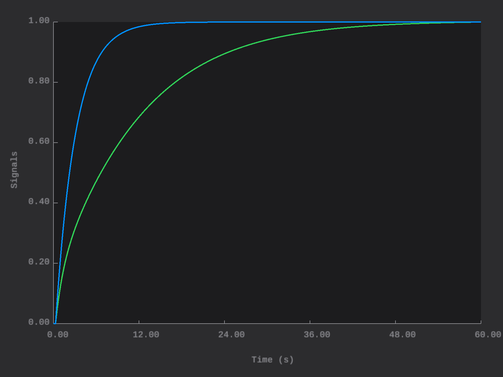 |

---

### system15 — $\frac{-s+1}{s+1}$ (f_corte = 100 Hz)

> Sistema não-mínimo de fase (zero no semiplano direito). Ziegler-Nichols e Hägglund resultaram em τ negativo (sistema instável identificado), gerando métricas infinitas. Smith2 falhou por parâmetro fora do intervalo.

| Método | K | θ | τ / ζ | ωₙ | IAE | ISE | ITAE |
|--------|---|---|-------|----|-----|-----|------|
| Ziegler-Nichols | 1,0923 | 0,00135 | τ=−0,00588 | — | ∞ | ∞ | ∞ |
| Hägglund | 1,0923 | 0,00135 | τ=−0,00340 | — | ∞ | ∞ | ∞ |
| Smith1 | 1,0923 | 0,624 | τ=0,846 | — | 0,1315 | 0,03028 | 504,22 |
| Sundaresan | 1,0923 | 0,679 | τ=0,756 | — | 0,1353 | 0,03156 | 517,72 |
| **Mollenkamp** | **1,0000** | **0,483** | **ζ=1,282** | **2,702** | **0,0564** | **0,02093** | **65,49** |
| Smith2 | — | — | — | — | FALHOU | — | — |

> **Melhor método:** Mollenkamp (menor IAE e ITAE). Ziegler-Nichols e Hägglund falham completamente pois a resposta ao degrau de um sistema não-mínimo de fase possui uma inversão inicial que confunde a estimativa da tangente.

| Mollenkamp | Smith1 |
|------------|--------|
| 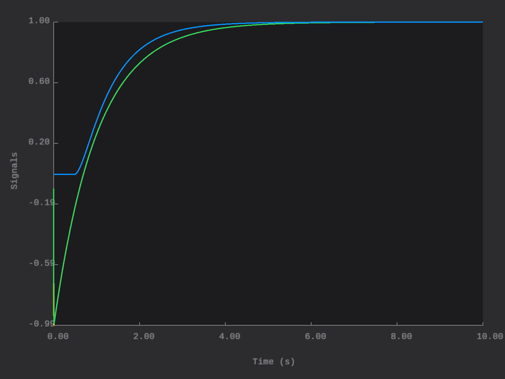 | 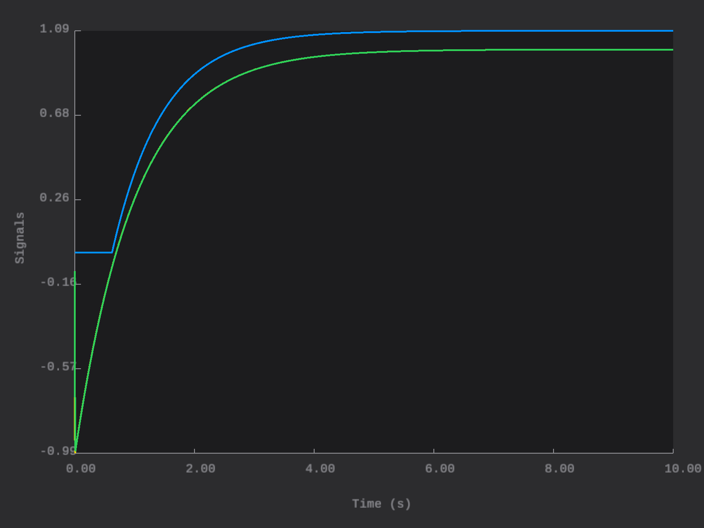 |

---

## Conclusão

Este trabalho aplicou seis métodos de identificação de sistemas — Ziegler-Nichols, Hägglund, Smith (1ª ordem), Sundaresan-Krishnaswamy, Mollenkamp e Smith (2ª ordem) — a onze conjuntos de dados distintos, avaliando a qualidade das identificações pelas métricas IAE, ISE e ITAE.

As principais conclusões são:

1. **Mollenkamp** foi o método de melhor desempenho geral, obtendo as menores métricas em quatro dos onze datasets (conjunto3, conjunto5, system9 e system15). Sua capacidade de modelar dinâmicas de segunda ordem confere uma vantagem significativa quando o sistema real possui dois polos dominantes.

2. **Hägglund** destacou-se entre os métodos de primeira ordem, superando Ziegler-Nichols em praticamente todos os casos. Isso era esperado, pois o Hägglund corrige a superestimação de τ inerente ao método de Ziegler-Nichols pela tangente no ponto de inflexão.

3. **Smith1** apresentou bom desempenho para sistemas de ordem elevada (system3, system6) onde os métodos de segunda ordem falharam por geração de θ negativo.

4. **Limitações dos métodos:** Smith2 requer que o parâmetro de razão dos tempos esteja no intervalo [0,255; 0,8], o que é violado por sistemas com zeros ou dinâmicas muito amortecidas. Os métodos baseados em tangente (Ziegler-Nichols e Hägglund) falham completamente em sistemas não-mínimos de fase, como o system15, pois a inversão inicial da resposta ao degrau invalida as hipóteses do método.

5. **Sistemas difíceis:** O system12 (com zeros e atraso) e o system3 (4ª ordem) desafiaram a maioria dos métodos, que produziram θ negativos inválidos. Apenas Ziegler-Nichols e Hägglund (system12) ou Ziegler-Nichols e Smith1 (system3) conseguiram identificações válidas, indicando que sistemas de alta ordem com zeros exigem abordagens mais sofisticadas.

Em resumo, para aplicações práticas com sistemas desconhecidos, recomenda-se tentar primeiro o método de **Mollenkamp** (melhor desempenho médio) e, em caso de falha por θ negativo ou parâmetro fora do intervalo, recorrer ao **Hägglund** como alternativa robusta de primeira ordem.
